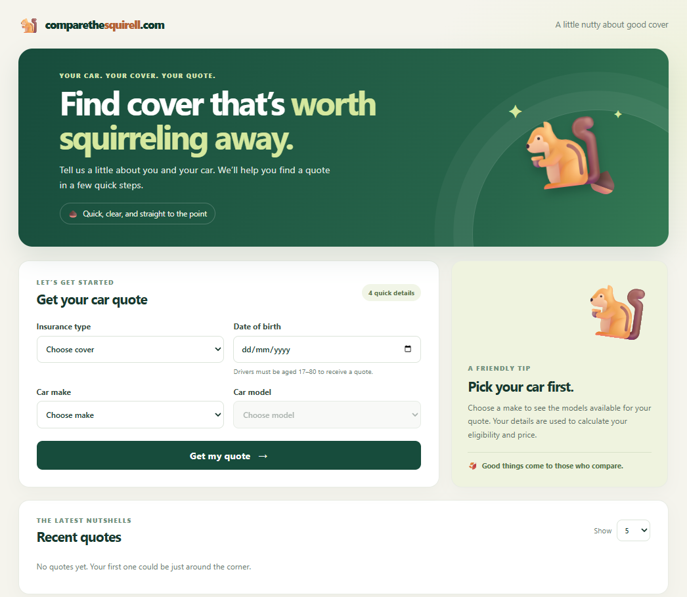

# Dummy Car Quotes Site

I created this dummy car quote website for the assessment criteria below. The main focus was improving the API and unit tests, and I also created a web front end using HTML, JavaScript, and CSS to make the application feel more complete.

I used GitHub Copilot to speed up development, as AI use was allowed for this assessment. I verified the generated output and can explain the code.



## How to run

1. Clone the repository.
2. Build the solution and run the project through IIS Express.
3. The homepage should open automatically. If it does not, navigate to <http://localhost:62044/>.

## API endpoints

Use Postman or another API client to call the endpoints below.

| Method | Endpoint | Description |
| --- | --- | --- |
| `GET` | `/quote` | Returns quote options, including insurance types and available vehicle options. |
| `POST` | `/quote` | Validates a quote request and returns the calculated quote or validation/error details. |
| `GET` | `/quote/{id}` | Retrieves a saved quote by its GUID. Returns `404` if it is not found. |
| `GET` | `/quotes?count=5` | Returns the most recent quotes. `count` defaults to 5 and must be between 1 and 100. |

### Example: request a quote

Send a `POST` request to <http://localhost:62044/quote> with this JSON body:

```json
{
  "dateOfBirth": "2000-05-01",
  "insuranceType": "FullyComprehensive",
  "make": "Audi",
  "model": "A3"
}
```

Example response:

```json
{
  "requestValid": true,
  "quoteAvailable": true,
  "quoteId": "e6870c49-8aaa-406f-8e2a-f2f4b780f1e5",
  "quote": 300
}
```

## Initial README / Assessment Criteria

This demonstration application can be used to practice development skills or try out new ideas. For example:

- Fix the runtime bug that prevents BMW models from being displayed.
- Extend quote calculations to account for the driver's date of birth, making quotes unavailable to people under 17 or over 80. Consider refactoring the system to make it easier to extend, and add unit tests for the changes.
- Improve the user experience by refining the interface or validation. For example, add validation for the date-of-birth rules described above and cover it with unit tests.
- Add persistent storage so quotes can be retrieved later.
